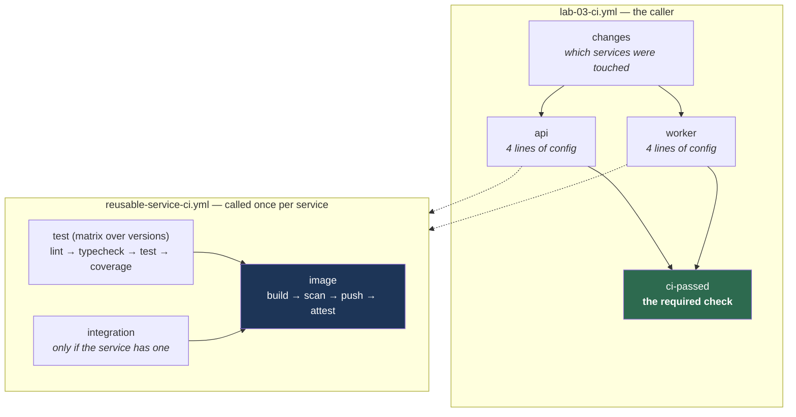

# The pipeline: shape and cost

What runs on a change, why it is arranged that way, and what it costs.

Measured 2026-09-21 against commit `3574784`. The registry section below was
added when Capstone A moved publishing to ECR alongside GHCR.

---

## Shape

One reusable workflow does the whole build contract for one service. The
callers are configuration.



### The nine steps, in order

```
lint → typecheck → test → coverage → build → SBOM → scan → sign → push
```

Cheapest first. An unused import fails in seconds rather than after a
four-minute image build.

### Three orderings that are not arbitrary

**`scan` before `push`.** A scan after the push is a report; a scan before it
is a gate. Both go red on a bad image; only one keeps it out of the registry.

**`image` after `test`.** There is no point building an image from code that
does not lint, typecheck, test, or meet its coverage floor.

**`image` tolerates a skipped `integration`.** The worker has no integration
suite, so that job skips — and a plain `needs` would skip the image job with
it. The condition is `always()` plus explicit result checks.

### Where the gates are

| Gate | Fails when | Blocks |
|---|---|---|
| `make lint` | formatting or lint errors | the merge |
| `make typecheck` | type errors | the merge |
| `make coverage` | coverage below the floor | the merge |
| Trivy | a fixable HIGH or CRITICAL | the publish **and** the merge |
| `ci-passed` | any service failed | the merge |
| Branch protection | `ci-passed` is not green | the merge |

`ci-passed` treats **skipped** as acceptable. That is what lets path filtering
work at all: a change to `app/api` skips the worker, and a required check that
never reports would otherwise block the pull request forever.

---

## Cost

GitHub-hosted Linux runners, public repository.

### Per merge to `main`

| Workflow | Jobs | Job-seconds | Gates anything |
|---|---|---|---|
| `lab-03-ci` | 10 | **273** | yes — this is the pipeline |
| `lab-02-ci` | 6 | 60 | no |
| `lab-01-ci` | 2 | 19 | no |
| `security` | 1 | 6 | yes |
| **Total** | **19** | **358** (6.0 min) | |

Wall-clock is about **two minutes**, because most of those jobs run in parallel.

### What that would cost

Public repositories get GitHub-hosted runners free, so **this repository costs
nothing**. The numbers matter anyway, because the habits transfer.

At the private-repository rate of $0.008/minute for Linux:

| Merges per month | Job-minutes | Cost |
|---|---|---|
| 20 | 120 | $0.96 |
| 100 | 600 | $4.80 |
| 500 | 3,000 | $24.00 |

A macOS runner is ten times that, which is the number that changes decisions.

### The 22% nobody needs

**79 of those 358 seconds — 22% — is `lab-01-ci` and `lab-02-ci`**, which exist
only as teaching artifacts. They gate nothing. `ci-passed` does not depend on
them and branch protection does not require them.

They stay because this repository is a curriculum: deleting them would delete
Labs 01 and 02's subject matter, and watching them run is part of the point.

**Do not copy that trade into a real repository.** Two workflows running on
every merge that no required check depends on is exactly the waste Lab 02
teaches you to find.

### What growth costs

Path filtering means a single-service change does not pay for the other
service:

| Change | Jobs that run | Jobs skipped |
|---|---|---|
| `app/api` only | api's 6 | worker's 3 |
| `app/worker` only | worker's 3 | api's 6 |
| a shared pipeline file | all 9 | none |
| documentation | all 9 | none |

That last row is worth a look. Any change to `.github/workflows/lab-03-ci.yml`,
`reusable-service-ci.yml`, or the composite action rebuilds **everything** —
deliberately, because a pipeline change that ships untested is worse than the
minutes it saves.

A documentation-only change also rebuilds everything, because `docs/**` is in no
filter. With two services that is cheap. It is the first thing to fix if the
repository grows.

### The matrix is most of the cost

`api` runs three Python versions and `worker` runs two Node versions, so five
of the nine jobs are matrix legs.

That is a deliberate purchase: version-specific breakage found by CI rather
than by a user. It also means **the pipeline got more expensive as it got
better**, and the honest comparison is not "before vs after" but "the same
change, filtered vs unfiltered."

---

## Registries

Images go to **two** places, for different reasons.

| | Why | Cost |
|---|---|---|
| **GHCR** | public, free, and where `gh attestation verify` is cheapest | $0 |
| **ECR** | what EKS pulls from in Track C, with no stored pull secret | ~$0.03/month |

A pull secret would be a stored credential, which is the thing Project 4 spent
its time removing — so ECR is not duplication, it is the prerequisite for
deploying without a regression.

**The retention cap is the whole cost control.** `infra/ecr` keeps ten tagged
images and expires untagged after a day. Every merge pushes two images, so
without a cap this grows forever, slowly enough that nobody notices.

```bash
aws ecr describe-images --repository-name ci-cd-lab/api --query 'length(imageDetails)'
```

Pushing to ECR needs the CI role, and that role is pinned to `main` and version
tags — so **a pull request builds and scans but cannot reach either registry**.
That is deliberate: see `docs/OIDC.md` for why a `:pull_request` subject is
reachable by anyone who can open one.

## How to measure this yourself

```bash
# the runs for one commit
gh run list --branch main --limit 5 --json databaseId,name,conclusion

# job-seconds for one run, excluding skipped jobs
gh run view <id> --json jobs,createdAt,updatedAt --jq '
  (.jobs | map(select(.conclusion != "skipped")
            | (.completedAt|fromdate) - (.startedAt|fromdate))) as $d |
  "wall-clock: \((.updatedAt|fromdate)-(.createdAt|fromdate))s",
  "job-seconds: \($d|add) across \($d|length) jobs"'
```

**Wall-clock and job-seconds move for different reasons.** Wall-clock includes
queueing for a runner, which you do not control. Job-seconds is what you are
billed for. Record both; judge by the second.
